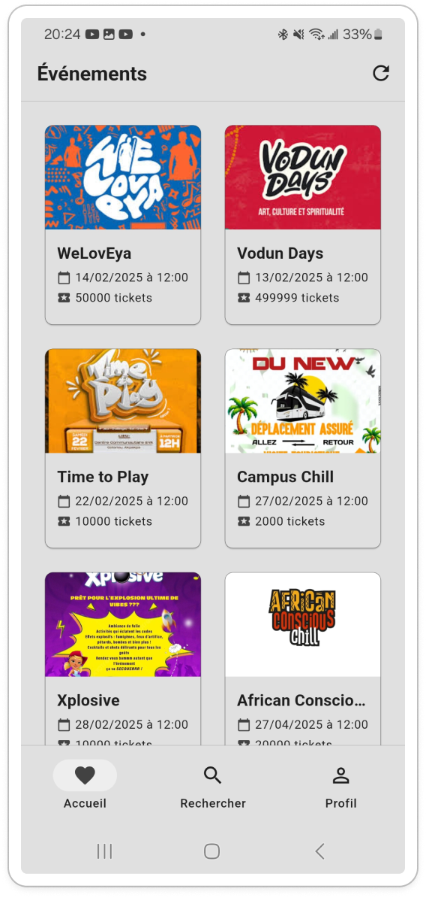
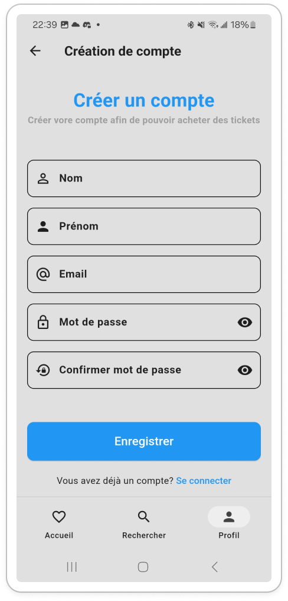
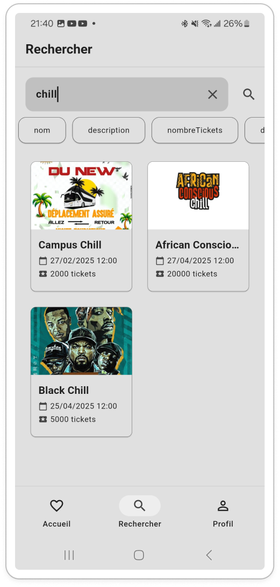
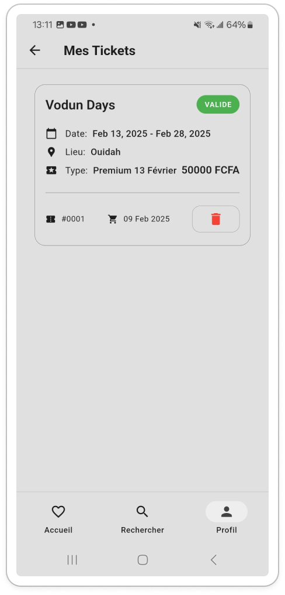
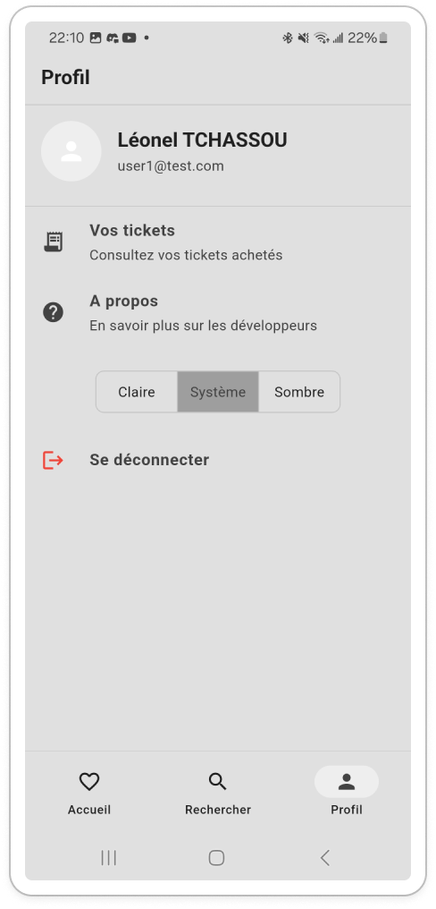
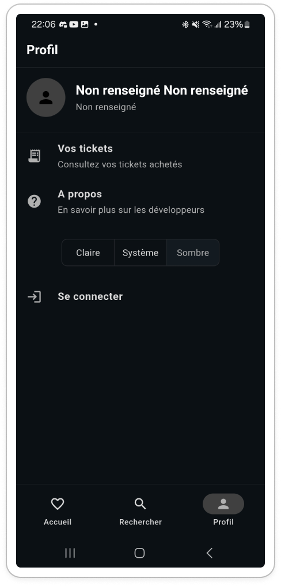

# Tickify

Une application Flutter pour acheter des billets d'événements en ligne. Il s'agit d'un projet scolaire qui simule les achats de billets sans gérer de vrais paiements.



## Fonctionnalités

- **Navigation d'événements** : Découvrez et explorez les événements disponibles
- **Achat de billets** : Simulez l'achat de billets pour des événements
- **Mes billets** : Affichez les billets achetés et vérifiez leur statut d'expiration
- **Authentification** : Fonctionnalité de connexion et d'inscription
- **Recherche** : Trouvez facilement des événements
- **Thèmes** : Support du mode clair et sombre

## Captures d'écran

### Authentification




### Recherche



### Mes billets



### Paramètres




## API

L'application communique avec une API personnalisée pour les données d'événements et la gestion des billets.

- [Documentation de l'API](https://documenter.getpostman.com/view/41012504/2sAYX6qNVW)
- [Code source de l'API](https://gitlab.com/leonel.tchassou/tickify-api)

## Installation

Assurez-vous que Flutter est installé sur votre système. Pour plus d'informations, consultez la [documentation officielle de Flutter](https://flutter.dev/docs/get-started/install).

Clonez le dépôt et installez les dépendances :

```bash
git clone https://gitlab.com/leonel.tchassou/tickify
cd tickify
flutter pub get
```

Pour lancer l'application :

```bash
flutter run
```
